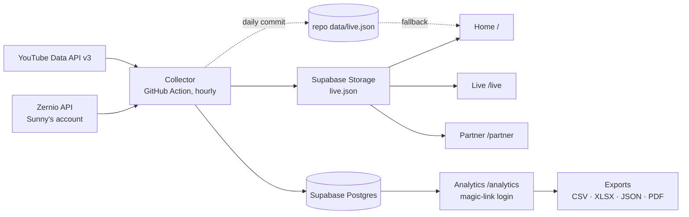

# TSN Talks: live site and analytics

Design spec, 2026-09-15. Owner: Ney (delivery and QA). Client: Sunny Sakchiraphong, TSN Talks / Thai Sikh News.

## 1. Goal

Replace the hand-typed TSN Talks media kit with a redesigned site whose numbers are read live from YouTube, Instagram and TikTok, and give Sunny and Ney a private analytics dashboard with real granularity, time-frame selection and exports. Everything runs under Ney's accounts for now and transfers to Sunny later.

Success looks like: a sponsor opens the site from a LINE link and believes the numbers without asking "as of when"; Sunny never edits a statistic by hand again; Ney can answer "which platform is growing, which episode delivered, what should the next guest be" from the dashboard in under a minute.

## 2. What is decided

| Decision | Choice |
|---|---|
| Aggregator | Zernio, Sunny's account. YouTube, Instagram, TikTok connected. Facebook excluded. |
| Full episode catalogue | YouTube Data API v3 (public key). Zernio only imports recent posts. yt-dlp is the fallback until the key exists. |
| Data store and auth | Supabase (Postgres, Auth, Storage), new project `tsntalks` in Ney's org, region ap-southeast-1. |
| Collector | GitHub Actions cron, Python. |
| Hosting | Static site on GitHub Pages under Ney's GitHub (`neramitsingh/tsntalks`). Domain (Hostinger, Sunny's) attached later. |
| Visual direction | D1 "Marquee": Bodoni Moda display, Hanken Grotesk text. Palette kept: ground `#0D0706`, saffron `#E8621A`, gold `#C8901E` / `#E0B040`, cream `#F2E4CC`. |
| Platform colours | YouTube `#E8621A`, TikTok `#2EA6A0`, Instagram `#7C6BF0`. Validated for colour-blind separation on the dark ground. Fixed, never reassigned. |
| Public register | Brand. A media kit that happens to be live. Never a dashboard. |
| Private register | Product. A dashboard. Familiar controls, dense where useful. |

## 3. Surfaces



### 3.1 Home `/` (public, brand)

Direction D1 as sketched in `sketches/home-D1-marquee.template.html`, built properly.

1. **Hero.** The latest episode's still full-bleed, the guest's name in Bodoni set huge and left-aligned, season and episode line, role, "Watch the episode". Under it a single strap line with the live numbers: total views across platforms, followers, episode count, updated time, live dot.
2. **Season two.** A poster wall of the season's episodes in mixed sizes: the most-viewed episode large, the next two medium, the rest small. Guest name and live YouTube views on each. No identical cards.
3. **Season one.** A two-column text index: number, guest, role.
4. **Who is listening.** One large figure (total views), a paragraph that states gender, largest age band and the India/Thailand split in words, a proportion bar by platform, and two printed-report tables: YouTube viewers by age, YouTube views by country.
5. **Founder.** Portrait, pull quote, one paragraph, byline with the Thai Sikh News mark.
6. **Partner.** The five sponsorship options as a numbered list with prices, two buttons: "Talk to us" (mailto) and "See bundle pricing" (to `/partner`).
7. **Footer.** Platform links as text.

All numbers on this page come from `live.json`. First paint uses the daily copy committed in the repo so the page never renders empty; the page then fetches the hourly copy from Storage and updates in place. If both fail, the baked numbers stay and the strap says "updated <date>" with no live dot.

### 3.2 Live `/live` (public, brand)

The deeper public view, shape from live sketch B, restyled in the D1 system:

1. One number: total views, with the platform proportion bar and a legend carrying views, followers and top post per platform.
2. "When the hits happened": stacked columns of views by publish month, three series, direct label on the peak only, legend, scrollable on phones.
3. "Who is watching": YouTube views by country as a split bar, mirrored age chart (YouTube share of views vs Instagram share of followers), four plain facts.
4. "Now playing": latest episode plus the six most-watched posts across platforms.
5. Footer naming source, window and delays.

### 3.3 Partner `/partner` (public, brand)

The existing sponsorship content (five options, five bundles) restyled in the D1 system. Prices unchanged. The "guaranteed reach" bundle figures stay as typed claims because they are commitments, not measurements; a footnote says so.

### 3.4 Analytics `/analytics` (private, product)

**Access.** Supabase Auth magic link. An `allowed_users` table holds the emails that may sign in (Ney, Sunny). Row-level security on every table: `select` for authenticated users present in `allowed_users`, nothing for anonymous. The collector uses the service-role key and never runs in the browser.

**Controls, one row above everything, applied to every view:**

- Time frame: presets 7d, 30d, 90d, 12m, all, and a custom from/to. Bangkok time.
- Granularity: hour (only when the frame is 7 days or less), day, week, month. The default follows the frame: 7d → day, 30d → day, 90d → week, 12m → month.
- Platform: all, YouTube, Instagram, TikTok.
- Compare: off, or previous period of the same length (deltas shown next to every headline figure).

**Views (tabs):**

| Tab | What it answers | Content |
|---|---|---|
| Overview | How are we doing? | Headline figures with deltas (views, followers, posts published, engagement), views over time by platform, follower growth by platform, top posts in the frame. |
| Growth | Which channel is growing? | Follower count per platform as lines, followers gained and lost per period, YouTube subscribers gained and lost, watch time and average view duration per period. |
| Posts | What performed? | Sortable, filterable table of every post: platform, published, title, views, likes, comments, shares, reach, engagement rate, views gained in the frame (from snapshots). Click a row for the post's own growth curve. |
| Episodes | What did one episode deliver? | One row per episode: YouTube views, number of clips, clip views by platform, total reach for the episode across all cuts. Click an episode for its report. |
| Audience | Who watches? | YouTube age, gender, country; Instagram age, city, country; each as bars with a table twin; change versus the previous window. |
| Health | Is the pipeline alive? | Last collector run, per-account status from Zernio (token validity, reconnect needed), row counts, freshness. |

**Episode report.** A print-ready page for one episode: still, guest, published date, YouTube lifetime views and 7 / 30 day views, every clip with its platform and views, audience of the episode where YouTube exposes it, and a one-line source note. This is the artifact Sunny sends a sponsor after their episode.

**Exports.** Every table and chart has an export menu, and the controls row has "Export this view":

- CSV and JSON: generated in the browser from the exact rows on screen, with the applied frame and filters in the filename.
- XLSX: SheetJS (UMD, pinned version, from cdnjs), one sheet per table in the view.
- PDF: the view's print stylesheet plus the episode report. The browser's print-to-PDF is the mechanism; the layout is designed for A4 portrait.

**Charts** follow the dataviz rules already applied in the sketches: thin marks, 2px surface gaps, hairline solid gridlines, selective direct labels, legend for two or more series, tooltip plus a table twin for every chart, no dual axes, hero figures in the sans.

## 4. Data model (Supabase)

```sql
accounts(id text pk, platform text, handle text, display_name text, avatar_url text, connected_at timestamptz, active bool)
account_snapshots(account_id text, taken_at timestamptz, followers int, following int, total_likes bigint, post_count int, pk(account_id, taken_at))
posts(id text pk, account_id text, platform text, url text, title text, media_type text, published_at timestamptz, thumb_url text, episode_id int null, first_seen_at timestamptz, last_seen_at timestamptz)
post_snapshots(post_id text, taken_at timestamptz, views bigint, likes int, comments int, shares int, saves int, reach bigint, impressions bigint, engagement_rate numeric, pk(post_id, taken_at))
metric_daily(account_id text, day date, metric text, value numeric, pk(account_id, day, metric))
  -- yt_views, yt_minutes, yt_avg_duration, yt_subs_gained, yt_subs_lost, ig_reach, ig_views, ig_engaged, ig_interactions, ig_follows, ig_unfollows, tt_followers_gained, tt_followers_lost
demographics(account_id text, kind text, dimension text, value numeric, window_start date, window_end date, taken_at timestamptz, pk(account_id, kind, dimension, window_start, window_end))
  -- kind: yt_age, yt_gender, yt_country, ig_age, ig_gender, ig_city, ig_country
episodes(id serial pk, season int, number text, title text, guest text, role text, youtube_video_id text unique, published_at timestamptz, match_terms text[])
collector_runs(id bigserial pk, started_at timestamptz, finished_at timestamptz, status text, rows_written int, notes jsonb)
account_health(account_id text, checked_at timestamptz, status text, can_fetch_analytics bool, needs_reconnect bool, token_expires_at timestamptz, pk(account_id, checked_at))
allowed_users(email text pk, name text)
```

Rollups are SQL functions the page calls through PostgREST, for example `rollup_views(from_ts, to_ts, granularity, platform)` returning one row per period per platform using `date_trunc` in Asia/Bangkok. Snapshot deltas (views gained in a period) are computed as last snapshot in the period minus last snapshot before it. Hourly snapshots are kept for 90 days, then thinned to one per day by a scheduled SQL job.

Clip-to-episode matching: `posts.episode_id` is set by the collector when a post's title matches an episode's `match_terms` (guest surname, episode number). Unmatched posts stay unmatched and show in the Episodes tab under "Unassigned" where Ney can assign them by hand; the assignment is written back to `posts.episode_id`.

## 5. Collector

Python 3.12, one package `collector/` with a CLI: `collect` (hourly), `backfill-youtube` (once), `publish-live-json`, `health`. Runs in GitHub Actions on `0 * * * *` with secrets `ZERNIO_API_KEY`, `SUPABASE_URL`, `SUPABASE_SERVICE_ROLE_KEY`, `YOUTUBE_API_KEY`.

Each run, in order:

1. `GET /v1/accounts` and `GET /v1/accounts/health` → upsert `accounts`, insert `account_health`. If any account `needsReconnect`, the run continues but the job exits non-zero at the end so GitHub emails Ney.
2. `GET /v1/accounts/follower-stats` → insert `account_snapshots`.
3. `GET /v1/analytics?platform=…&limit=100&page=n` for each platform, 366-day window → upsert `posts`, insert `post_snapshots` only when a value changed since the last snapshot (Zernio's `lastUpdated` decides).
4. YouTube Data API: `playlistItems` on the channel's uploads playlist, then `videos` in batches of 50 → upsert `posts` for every video Zernio did not return, with lifetime `viewCount`, `likeCount`, `commentCount` as a snapshot.
5. Once a day (first run after 03:00 Bangkok): YouTube channel insights for the last 3 finalised days, YouTube demographics (channel, 90-day window), Instagram account insights and follower history (last 30 days), Instagram demographics, TikTok account insights → `metric_daily`, `demographics`.
6. Match posts to episodes.
7. Build `live.json` (the fields the public pages need, about 20 KB) → upload to Storage bucket `public` with `cache-control: max-age=300`; once a day also commit it to `data/live.json`.
8. Write `collector_runs`.

Backfill (run once at setup): YouTube channel insights month by month for the previous 12 months in 88-day chunks; YouTube daily views for the top 30 videos by lifetime views; every video's lifetime stats from the Data API. Instagram and TikTok have no backfillable history beyond what Zernio has snapshotted since 14 September 2026.

Idempotency: every write is an upsert on the primary key; a re-run of the same hour writes nothing new. Rate limits: Zernio's `nextUpdate` is respected per post; the Data API costs under 100 units per run against a 10,000 daily quota.

## 6. Site build

Plain HTML, CSS and JavaScript, no framework. One `site.css` with the tokens, type scale and components shared by the three public pages; `analytics.css` extends it for the dashboard. Pages are static files in `site/`; GitHub Pages serves `site/`. Fonts from Google Fonts with system fallbacks. No build step for the public pages; the analytics page loads Supabase JS and SheetJS from cdnjs, pinned.

Images: episode stills from YouTube (`maxresdefault` where it exists, `hqdefault` otherwise) until Sunny supplies clean studio stills and portraits; the poster wall is written so that dropping a file at `site/img/episodes/<video_id>.jpg` overrides the YouTube still.

Motion: the live dot pulse, poster-wall image scale on hover, and one reveal on the hero name. Every animation has a `prefers-reduced-motion` alternative. Nothing else moves.

Accessibility: WCAG AA contrast checked on every text colour (`--muted` is `#A08468`, not the site's old `#7A6050`); numbers always in text, never only as bar lengths; tables have headers; charts have table twins; focus states on every control.

## 7. Failure handling

- Public pages: fetch of `live.json` fails → keep baked numbers, drop the live dot, show "updated <date>". Data older than 3 hours → strap shows "updated <n> hours ago" in the muted colour.
- Collector: a platform failing does not stop the others; the run records which steps failed and exits non-zero. GitHub's failure email goes to Ney. Health tab shows the same.
- Zernio tokens: YouTube refreshes automatically; TikTok tokens expire and Zernio reports `needsReconnect`; the Health tab and the failure email both name the account so Sunny can reconnect from the same link flow used on day one.
- Supabase paused (free tier pauses after a week of inactivity): the hourly collector keeps it awake; the Health tab shows the last successful write.

## 8. Testing

- Collector: unit tests against recorded Zernio and YouTube responses (fixtures captured 2026-09-14); a `--dry-run` that prints the rows it would write; a test that a second identical run writes zero rows.
- SQL: rollup functions tested against a seeded fixture with known totals per day, week, month and platform, including the Bangkok day boundary.
- Pages: Playwright screenshots at 1440 and 390 widths for every page; no horizontal overflow; fonts loaded; every number on the home page reconciled against Zernio's dashboard before launch.
- Analytics: login as an allowed user works, a non-allowed email gets no rows; each export downloads and re-opens (CSV in Python, XLSX via openpyxl, JSON parses); the PDF layout checked in print preview.
- Ship bar per Ney: click through every page on desktop and phone before calling it done.

## 9. Hand-over later

Repo transfer to Sunny's GitHub, Supabase project transfer to an org Sunny owns, secrets re-entered in his repo settings, DNS from Hostinger to GitHub Pages. Zernio is already his. The only Ney-owned credential in the system is the YouTube Data API key, which is replaced by one from Sunny's Google Cloud at hand-over.

## 10. Build order

1. Supabase project, schema, RLS, allowed users. Collector with tests. Backfill. Hourly Action live. History starts accruing.
2. Public site: `site.css`, home, live, partner. Reconcile numbers. Deploy to GitHub Pages.
3. Analytics: auth, controls, Overview and Posts tabs first, then Growth, Episodes, Audience, Health; exports; episode report.
4. Domain, hand-over prep.

## 11. Open items

- Clean episode stills and a proper founder portrait from Sunny (the YouTube thumbnails carry baked-in text).
- YouTube Data API key: needs a Google Cloud project on Ney's Google account; until then the collector uses yt-dlp for the catalogue.
- The domain name and whether Hostinger hosting came with it.
