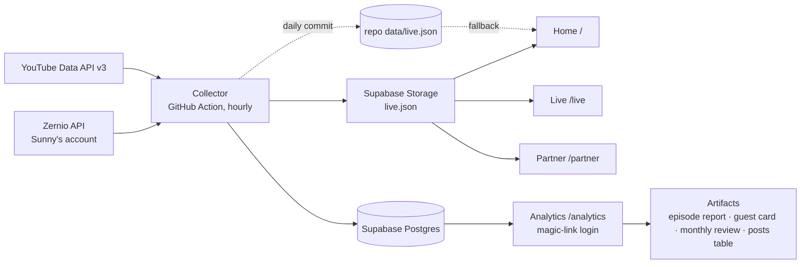

# TSN Talks: live site and analytics

Design spec, 2026-09-15. Owner: Ney (delivery and QA). Client: Sunny Sakchiraphong, TSN Talks / Thai Sikh News.

## 1. Goal

Replace the hand-typed TSN Talks media kit with a redesigned site whose numbers are read live from YouTube, Instagram and TikTok, and give Sunny and Ney a private analytics dashboard with real granularity, time-frame selection and exports. Everything runs under Ney's accounts for now and transfers to Sunny later.

Success looks like: a sponsor opens the site from a LINE link and believes the numbers without asking "as of when"; Sunny never edits a statistic by hand again; Ney can answer "which platform is growing, which episode delivered, what should the next guest be" from the dashboard in under a minute.

## 2. What is decided

| Decision | Choice |
|---|---|
| Aggregator | Zernio, Sunny's account. YouTube, Instagram, TikTok connected. Facebook excluded. |
| Full episode catalogue | YouTube Data API v3 (public key). Zernio only imports recent posts. yt-dlp is the fallback until the key exists. |
| Data store and auth | Supabase (Postgres, Auth, Storage), new project `tsntalks` in Ney's org, region ap-southeast-1. |
| Collector | GitHub Actions cron, Python. |
| Hosting | Static site on GitHub Pages under Ney's GitHub (`neramitsingh/tsntalks`). Domain (Hostinger, Sunny's) attached later. |
| Visual direction | D1 "Marquee": **Archivo condensed capitals** for display, Hanken Grotesk text, Noto Sans Thai behind both for `฿`. Palette kept: ground `#0D0706`, saffron `#E8621A`, gold `#E0B040`, cream `#F2E4CC`. *Revised 2026-09-15 — was Bodoni Moda; see "Typography revision" below.* |
| Platform colours | YouTube `#E8621A`, TikTok `#2EA6A0`, Instagram `#7C6BF0`. Validated for colour-blind separation on the dark ground. Fixed, never reassigned. |
| Public register | Brand. A media kit that happens to be live. Never a dashboard. |
| Private register | Product. A dashboard. Familiar controls, dense where useful. |

## 3. Surfaces



### 3.1 Home `/` (public, brand)

Direction D1 as sketched in `sketches/home-D1-marquee.template.html`, built properly.

1. **Hero.** The latest episode's artwork shown **whole and unscrimmed** beside the page's own type: the show's proposition as the `<h1>`, the entry price, and two calls to action. The guest's name sits in the artwork's caption, not over the image. *Revised 2026-09-15 — was a full-bleed scrimmed still with the guest's name overprinted at 137px; see "Typography revision" below.* Under it a single strap line with the live numbers: total views across platforms, followers, episode count, updated time, live dot.
2. **Season two.** A poster wall of the season's episodes in mixed sizes: the most-viewed episode large, the next two medium, the rest small. Guest name and live YouTube views on each. No identical cards.
3. **Season one.** A two-column text index: number, guest, role.
4. **Who is listening.** One large figure (total views), a paragraph that states gender, largest age band and the India/Thailand split in words, a proportion bar by platform, and two printed-report tables: YouTube viewers by age, YouTube views by country.
5. **Founder.** Portrait, pull quote, one paragraph, byline with the Thai Sikh News mark.
6. **Partner.** The five sponsorship options as a numbered list with prices, two buttons: "Talk to us" (mailto) and "See bundle pricing" (to `/partner`).
7. **Footer.** Platform links as text.

All numbers on this page come from `live.json`. First paint uses the daily copy committed in the repo so the page never renders empty; the page then fetches the hourly copy from Storage and updates in place. If both fail, the baked numbers stay and the strap says "updated <date>" with no live dot.

### 3.2 Live `/live` (public, brand)

The deeper public view, shape from live sketch B, restyled in the D1 system:

1. One number: total views, with the platform proportion bar and a legend carrying views, followers and top post per platform.
2. "When the hits happened": stacked columns of views by publish month, three series, direct label on the peak only, legend, scrollable on phones.
3. "Who is watching": YouTube views by country as a split bar, mirrored age chart (YouTube share of views vs Instagram share of followers), four plain facts.
4. "Now playing": latest episode plus the six most-watched posts across platforms.
5. Footer naming source, window and delays.

### 3.3 Partner `/partner` (public, brand)

The existing sponsorship content (five options, five bundles) restyled in the D1 system. Prices unchanged. The "guaranteed reach" bundle figures stay as typed claims because they are commitments, not measurements; a footnote says so.

### 3.4 Analytics `/analytics` (private, product)

**Access.** Supabase Auth magic link. An `allowed_users` table holds the emails that may sign in (Ney, Sunny). Row-level security on every table: `select` for authenticated users present in `allowed_users`, nothing for anonymous. The collector uses the service-role key and never runs in the browser.

**Controls, one row above everything, applied to every view:**

- Time frame: presets 7d, 30d, 90d, 12m, all, and a custom from/to. Bangkok time.
- Granularity: hour (only when the frame is 7 days or less), day, week, month. The default follows the frame: 7d → day, 30d → day, 90d → week, 12m → month.
- Platform: all, YouTube, Instagram, TikTok.
- Compare: off, or previous period of the same length (deltas shown next to every headline figure).

**Views (tabs):**

| Tab | What it answers | Content |
|---|---|---|
| Overview | How are we doing? | Headline figures with deltas (views, followers, posts published, engagement), views over time by platform, follower growth by platform, top posts in the frame. |
| Growth | Which channel is growing? | Follower count per platform as lines, followers gained and lost per period, YouTube subscribers gained and lost, watch time and average view duration per period. |
| Posts | What performed? | Sortable, filterable table of every post: platform, published, title, views, likes, comments, shares, reach, engagement rate, views gained in the frame (from snapshots). Click a row for the post's own growth curve. |
| Episodes | What did one episode deliver? | One row per episode: YouTube views, number of clips, clip views by platform, total reach for the episode across all cuts. From a row: the episode report and the guest card. |
| Audience | Who watches? | YouTube age, gender, country; Instagram age, city, country; each as bars with a table twin; change versus the previous window. |
| Health | Is the pipeline alive? | Last collector run, per-account status from Zernio (token validity, reconnect needed), row counts, freshness. |

**Exports with a purpose.** There is no generic "export this view". Each export is a named artifact with a recipient, designed as a page and produced from the dashboard in one click. This set is **decided** (2026-09-15) and is what gets built; if Sunny later wants a sixth, or a different format, that is an edit to a working dashboard rather than a precondition for starting one:

| Artifact | Sent to | Contents | Format |
|---|---|---|---|
| **Episode report** | The episode's sponsor, after it airs | Still, guest, date; YouTube views lifetime and at 7 and 30 days; every clip with platform and views; total reach across all cuts; audience where YouTube exposes it; source note | PDF, A4 portrait |
| **Guest card** | The guest, a week after their episode | One page: "your episode reached N people", top clip, platform split, a share link | PDF and a PNG sized for LINE and Instagram |
| **Monthly review** | Sunny and Thai Sikh News | Month against previous month by platform: views, followers gained, posts published, top five posts, audience shift; one page of charts with their tables | PDF, plus XLSX with the underlying tables |
| **Numbers as of today** | A sponsor who asks for a deck | The live page's figures frozen at a date, same layout as the site | PDF |
| **Posts table** | Whoever wants a spreadsheet | The Posts tab's current rows and filters | CSV and XLSX |

Mechanism: each artifact is its own print-designed page in the dashboard; PDF comes from the browser's print-to-PDF, PNG from a canvas render of the card, CSV and XLSX are built in the browser (SheetJS, UMD, pinned, from cdnjs). Filenames carry the artifact, subject and date.

Everything else stays on screen with a table twin. If Sunny asks for something new it becomes a sixth artifact with a named recipient, not a menu item — and it is added after the five exist, not before.

**Charts** follow the dataviz rules already applied in the sketches: thin marks, 2px surface gaps, hairline solid gridlines, selective direct labels, legend for two or more series, tooltip plus a table twin for every chart, no dual axes, hero figures in the sans.

## 4. Data model (Supabase)

```sql
accounts(id text pk, platform text, handle text, display_name text, avatar_url text, connected_at timestamptz, active bool)
account_snapshots(account_id text, taken_at timestamptz, followers int, following int, total_likes bigint, post_count int, pk(account_id, taken_at))
posts(id text pk, account_id text, platform text, url text, title text, media_type text, published_at timestamptz, thumb_url text, episode_id int null, first_seen_at timestamptz, last_seen_at timestamptz)
post_snapshots(post_id text, taken_at timestamptz, views bigint, likes int, comments int, shares int, saves int, reach bigint, impressions bigint, engagement_rate numeric, pk(post_id, taken_at))
metric_daily(account_id text, day date, metric text, value numeric, pk(account_id, day, metric))
  -- yt_views, yt_minutes, yt_avg_duration, yt_subs_gained, yt_subs_lost, ig_reach, ig_views, ig_engaged, ig_interactions, ig_follows, ig_unfollows, tt_followers_gained, tt_followers_lost
demographics(account_id text, kind text, dimension text, value numeric, window_start date, window_end date, taken_at timestamptz, pk(account_id, kind, dimension, window_start, window_end))
  -- kind: yt_age, yt_gender, yt_country, ig_age, ig_gender, ig_city, ig_country
episodes(id serial pk, season int, number text, title text, guest text, role text, youtube_video_id text unique, published_at timestamptz, match_terms text[])
collector_runs(id bigserial pk, started_at timestamptz, finished_at timestamptz, status text, rows_written int, notes jsonb)
account_health(account_id text, checked_at timestamptz, status text, can_fetch_analytics bool, needs_reconnect bool, token_expires_at timestamptz, pk(account_id, checked_at))
allowed_users(email text pk, name text)
```

Rollups are SQL functions the page calls through PostgREST, for example `rollup_views(from_ts, to_ts, granularity, platform)` returning one row per period per platform using `date_trunc` in Asia/Bangkok. Snapshot deltas (views gained in a period) are computed as last snapshot in the period minus last snapshot before it. Hourly snapshots are kept for 90 days, then thinned to one per day by a scheduled SQL job.

Clip-to-episode matching: `posts.episode_id` is set by the collector when a post's title matches an episode's `match_terms` (guest surname, episode number). Unmatched posts stay unmatched and show in the Episodes tab under "Unassigned" where Ney can assign them by hand; the assignment is written back to `posts.episode_id`.

## 5. Collector

Python 3.12, one package `collector/` with a CLI: `collect` (hourly), `backfill-youtube` (once), `publish-live-json`, `health`. Runs in GitHub Actions on `0 * * * *` with secrets `ZERNIO_API_KEY`, `SUPABASE_URL`, `SUPABASE_SERVICE_ROLE_KEY`, `YOUTUBE_API_KEY`.

Each run, in order:

1. `GET /v1/accounts` and `GET /v1/accounts/health` → upsert `accounts`, insert `account_health`. If any account `needsReconnect`, the run continues but the job exits non-zero at the end so GitHub emails Ney.
2. `GET /v1/accounts/follower-stats` → insert `account_snapshots`.
3. `GET /v1/analytics?platform=…&limit=100&page=n` for each platform, 366-day window → upsert `posts`, insert `post_snapshots` only when a value changed since the last snapshot (Zernio's `lastUpdated` decides).
4. YouTube Data API: `playlistItems` on the channel's uploads playlist, then `videos` in batches of 50 → upsert `posts` for every video Zernio did not return, with lifetime `viewCount`, `likeCount`, `commentCount` as a snapshot.
5. Once a day (first run after 03:00 Bangkok): YouTube channel insights for the last 3 finalised days, YouTube demographics (channel, 90-day window), Instagram account insights and follower history (last 30 days), Instagram demographics, TikTok account insights → `metric_daily`, `demographics`.
6. Match posts to episodes.
7. Build `live.json` (the fields the public pages need, about 20 KB) → upload to Storage bucket `public` with `cache-control: max-age=300`; once a day also commit it to `data/live.json`.
8. Write `collector_runs`.

Backfill (run once at setup): YouTube channel insights month by month for the previous 12 months in 88-day chunks; YouTube daily views for the top 30 videos by lifetime views; every video's lifetime stats from the Data API. Instagram and TikTok have no backfillable history beyond what Zernio has snapshotted since 14 September 2026.

Idempotency: every write is an upsert on the primary key; a re-run of the same hour writes nothing new. Rate limits: Zernio's `nextUpdate` is respected per post; the Data API costs under 100 units per run against a 10,000 daily quota.

## 6. Site build

Plain HTML, CSS and JavaScript, no framework. One `site.css` with the tokens, type scale and components shared by the three public pages; `analytics.css` extends it for the dashboard. Pages are static files in `site/`; GitHub Pages serves `site/`. Fonts from Google Fonts with system fallbacks. No build step for the public pages; the analytics page loads Supabase JS and SheetJS from cdnjs, pinned.

Images: episode stills from YouTube (`maxresdefault` where it exists, `hqdefault` otherwise) until Sunny supplies clean studio stills and portraits; the poster wall is written so that dropping a file at `site/img/episodes/<video_id>.jpg` overrides the YouTube still.

Motion: the live dot pulse, poster-wall image scale on hover, and one reveal on the hero name. Every animation has a `prefers-reduced-motion` alternative. Nothing else moves.

Accessibility: WCAG AA contrast checked on every text colour (`--muted` is `#A08468`, not the site's old `#7A6050`); numbers always in text, never only as bar lengths; tables have headers; charts have table twins; focus states on every control.

## 7. Failure handling

- Public pages: fetch of `live.json` fails → keep baked numbers, drop the live dot, show "updated <date>". Data older than 3 hours → strap shows "updated <n> hours ago" in the muted colour.
- Collector: a platform failing does not stop the others; the run records which steps failed and exits non-zero. GitHub's failure email goes to Ney. Health tab shows the same.
- Zernio tokens: YouTube refreshes automatically; TikTok tokens expire and Zernio reports `needsReconnect`; the Health tab and the failure email both name the account so Sunny can reconnect from the same link flow used on day one.
- Supabase paused (free tier pauses after a week of inactivity): the hourly collector keeps it awake; the Health tab shows the last successful write.

## 8. Testing

- Collector: unit tests against recorded Zernio and YouTube responses (fixtures captured 2026-09-14); a `--dry-run` that prints the rows it would write; a test that a second identical run writes zero rows.
- SQL: rollup functions tested against a seeded fixture with known totals per day, week, month and platform, including the Bangkok day boundary.
- Pages: Playwright screenshots at 1440 and 390 widths for every page; no horizontal overflow; fonts loaded; every number on the home page reconciled against Zernio's dashboard before launch.
- Analytics: login as an allowed user works, a non-allowed email gets no rows; each artifact is produced for a real episode and month and opened (CSV in Python, XLSX via openpyxl, PDF and PNG checked by eye against the on-screen numbers).
- Ship bar per Ney: click through every page on desktop and phone before calling it done.

## 9. Hand-over later

Repo transfer to Sunny's GitHub, Supabase project transfer to an org Sunny owns, secrets re-entered in his repo settings, DNS from Hostinger to GitHub Pages. Zernio is already his. The only Ney-owned credential in the system is the YouTube Data API key, which is replaced by one from Sunny's Google Cloud at hand-over.

## 10. Build order

1. Supabase project, schema, RLS, allowed users. Collector with tests. Backfill. Hourly Action live. History starts accruing.
2. Public site: `site.css`, home, live, partner. Reconcile numbers. Deploy to GitHub Pages.
3. Analytics: auth, controls, Overview and Posts tabs first, then Growth, Episodes, Audience, Health; then the artifacts in this order: episode report, posts table, monthly review, guest card, numbers as of today.
4. Domain, hand-over prep.

## 11. Open items

- Clean episode stills and a proper founder portrait from Sunny (the YouTube thumbnails carry baked-in text). **Not a blocker:** `site/img/episodes/<video_id>.jpg` overrides a thumbnail with no code change, and the hero scrim covers the gap meanwhile.
- YouTube Data API key: needs a Google Cloud project on Ney's Google account; until then the collector uses yt-dlp for the catalogue.
- The domain name and whether Hostinger hosting came with it. **Not a blocker:** the site is live on GitHub Pages; a domain is a DNS change on top.
- ~~Confirm the export artifacts with Sunny.~~ **Decided 2026-09-15** — the five above get built, in the order listed in §10. Sunny is welcome to ask for a sixth (for example a report format Thai Sikh News already uses) once he can see the five working.

---

## Typography revision — 2026-09-15

Ney's verdict on the shipped D1 build: *"the GitHub page still looks vibecoded."* A two-agent design critique
(`.impeccable/critique/2026-09-15T06-57-31Z__site-index-html.md`, 21/40) found the cause was not any single
value but the **aesthetic lane**. Given this brief's own anti-references — not cream, not SaaS-dashboard, not
Playfair/Plus Jakarta — the next place a model lands is editorial-typographic, and D1 landed there exactly:
display serif with a full italic axis, tracked micro-labels, hairline rules on ten components, one hue family,
and zero imagery on `/partner`. Bodoni Moda is not on any ban list, but it was the substitution move: the
nearest un-banned Didone to the Playfair the old site used. Same shape, one name over.

**The fix came from the show's own assets, not from a font catalogue.** Every episode thumbnail sets its
headline and the guest's name in heavy condensed gold capitals. The site was scrimming that artwork and
re-setting the same words in a Didone on top of it — covering up its own brand. `--display` is now **Archivo**
at `font-stretch: 70%` and weight 800, set in capitals, which is what the artwork is already speaking.

Three things follow from looking at the real assets rather than assuming:

- **There is no safe crop.** Season two ships at least two thumbnail layouts — a type panel on the right for
  episode 10, a headline across the bottom for episode 9 — so any fixed crop that works for one mutilates the
  other. Artwork is shown **whole**, `object-fit: contain` on a `--bg2` ground, captions underneath. This also
  removes the five measured contrast failures structurally: there is no text over a photograph anywhere now.
- **Season one is a different design system entirely** — studio portrait cut-outs on a warm gradient, with
  past sponsors' logos baked in. It stays a text index, not a wall, which is what it already was.
- **`฿` had no home.** Hanken Grotesk carries no Thai block, so the baht sign fell back to whatever the OS
  supplied at all fifteen-plus price points. Noto Sans Thai now sits behind both stacks.

Headings: nine across three pages, no two sharing a construction, and the `h1 em, h2 em, h3 em` italic-gold
rule is deleted. Gold italic survives in exactly one place, the wordmark.

## Studio revision — 2026-09-15, afternoon

Ney's verdict on the Archivo build: *"I am still not happy with it, maybe needs a discussion of the whole rework."*
A second two-agent critique (`.impeccable/critique/2026-09-15T08-13-51Z__site-index-html.md`, 26/40, up from 21)
found the lint-level tells gone and the **system itself** guessable: black ground, condensed caps, hairline rules,
one accent, thumbnails in boxes, split hero, one section grammar everywhere — the streaming-platform press-kit
lane. Archivo at 70% width sat beside the artwork's Bebas-lineage capitals as a near-miss. The show's own
identity (mic logo, portraits, the warm-lit studio, the news brand's mark) appeared nowhere except inside
thumbnails. Verdict: **direction, not polish.** Two reworks in one day had both operated at stylesheet level,
and designing by prohibition lands in the next-nearest template every time.

**The decision.** Three lanes were named — the studio, the community front page, the rate card as the object —
and three throwaway home-page sketches built from real frames (`sketches/home-S1-poster.html`, `-S2-room`,
`-S3-onebyone`), each betting on a different belief. Ney chose **S2 "The Room"**: *the sponsor is buying the
room; the guests are proof; the rate card is the product.* Scope: home first, then propagate. Imagery: frames
extracted from the episodes now, Sunny's stills to replace them whenever they arrive.

**What changed on the home page.**

- **The room is the hero.** A frame from the newest episode that has one, full-bleed behind the offer on
  desktop, in flow at 16:9 above it on a phone. The `<h1>` is the offer: *Put your brand in this room.* The
  guest is named in the caption at the foot of the room, never re-set in the page's type over their artwork.
  If no episode has a frame, the room is the ground colour alone; the page never falls back to a thumbnail
  there, because a thumbnail carries a headline and the copy would collide with it.
- **Frames, not thumbnails.** `infra/pick_stills.py` chooses one frame per episode from candidates pulled
  with yt-dlp (face first, then sharpness), writes `site/img/episodes/<id>.jpg` at 1600px with the top tenth
  cropped (the show burns its logo there, under the nav) and `site/img/faces/<id>.jpg` as a 4:5 crop. Both
  folders are manifested by the Pages workflow. YouTube throttles ranged reads on some videos, so coverage
  arrives episode by episode; the tiles fall back to the thumbnail framed on the guest, then to the name on wood.
- **Who has been in the room.** Season two as a strip of faces, newest first; season one as a packed grid of
  the same tiles. No view counts on any tile. The wall of thumbnails, and the collapsed text index, are gone.
- **Who has been on the wall.** A sponsors section rendered from `site/data/sponsors.json`, hidden while the
  list is empty. Season-one artwork carries SPARQ, SF Cinema and Talad Thai India; Sunny confirms which were
  paid before any is listed.
- **The rate card as a menu**, on a plate of the table's wood, priced per line, cheapest first. The JSON
  order in `data/pricing.json` is the display order, so the first row a reader meets agrees with the hero's
  floor. A generated `bundles-floor` block quotes the cheapest package under it.
- **The reply channel.** `site/data/contact.json` carries the email and, once known, Sunny's LINE link; with a
  LINE link present every primary button becomes *Message us on LINE* and email steps back. Until then the
  static `mailto:` stands.
- **Type and colour.** Antonio 700 caps for display (the font comparison against the artwork is in
  `sketches/shots/`), Bebas Neue for tracked labels, Hanken Grotesk for text, Noto Sans Thai behind all three.
  Ground `#140D09`, wood `#33200F`, amber `#F0A040`, gold `#E6B54A`. The nav carries the show's mark
  (`site/img/tsn-talks-mark.png`), not a logotype. `/live` and `/partner` inherit tokens, type and the mark and
  keep their layouts until their own turn.

**Tests.** The suite follows the page: the hero test asserts the offer as `<h1>` and the room's photograph as
the newest episode's still (it fails on purpose when a new episode drops without one); the wall tests became
strip tests; a new test scrolls the page and asserts no face tile ships as an empty box.

## Studio revision, part two — 2026-09-16, small hours: /partner and /live

The home page was rebuilt as "the room" on the 15th and shipped that night; the other two pages
followed in the same session, against the second critique's P1 and P2 items.

**The rate card (`/partner`).**

- **A fork before the prices.** The page opens on two plates cut from the same wood as the menu:
  *Sponsor one episode, from ฿15,000* and *Run a campaign, from ฿29,000*. Both floors are generated
  from `data/pricing.json` (`fork-episode-floor`, `fork-campaign-floor`), so a reader picks a lane
  before meeting ten prices. Ten offers in one column had every reader starting on the wrong one.
- **Frames, not thumbnails, on the money page.** The three-still reel stays, the one place the site
  shows the thing being sold, but it is now three frames from `site/img/episodes/` with the guest
  named underneath, and `site/img/partner/` (three YouTube thumbnails "as published") is gone. It is
  hand-chosen because the page is static by design; swapping a still is a one-line edit.
- **The tiers are the menu, in full.** The same `.menu` plate as home, each row carrying its long
  description, its includes list, and an *Ask about this* link whose mail subject names the option.
- **The campaigns are rows, not cards.** Five identical bordered cards named Bundle A/B/C became
  rows on a second plate: the term first (one week, one month, two months) because that is what a
  sponsor chooses between, the kit's own tag under it, one column of prices to compare down, the
  flagship marked by a gold rule down its edge rather than a different card. The reach disclaimer
  moved from 13px muted under the cards into the section's lede, in bold.
- **The reply channel is one module.** `site/js/contact.js`, shared by home and the rate card:
  with a LINE link in `site/data/contact.json` every primary button on both pages becomes
  *Message us on LINE* and the nav button becomes LINE; without one the static `mailto:` in the
  markup stands, so the page works with the script off. The nav's button on this page is the reply
  channel, not a link to itself, which also gives phones a sticky call to action.

**The numbers (`/live`).**

- **Position first.** The page leads with the platform's rolling 90 days (YouTube views, hours
  watched, net subscribers) in the same strap home uses for its totals, above the lifetime figure.
  A lifetime total with a month chart under it read as "peaked last November".
- **The peak month is named for what it is.** Under the column chart, when a platform's best post
  falls in the peak month and carries more than half of it, one sentence says so with the figures:
  *Nov 25 is mostly one post: 943,699 of its 1,248,662 views are a single TikTok clip.* The same
  numbers, the honest reading.
- **Now playing is second**, because Sunny opens the page after an episode drops and it was fourth.
  The latest episode is its committed frame; the tiles lost their borders and sit on the ground
  with captions underneath like every other photograph on the site.
- **Shares are of everyone the platform placed**, not of the six rows on show: Bangkok was quoted as
  83% of Instagram when it is 67% of the followers Instagram places in a city. `barTable` takes the
  whole list's total; the lede says so.
- **No heading skip.** The legend's platform names were `<h3>` under the `<h1>`; they are labels now.

**Stills.** All 32 episodes have a frame and a face crop. `infra/still_picks.json` carries the hand
picks the detector could not make: the guest sits on the right in the FORM studio episodes and the
detector took the larger face; it read a guest's hands as a face once; it chose a group photograph
from the b-roll. Every crop was checked against its episode thumbnail.

**Tests.** 68 in `tests/site`: the fork quotes both floors; the reel is frames, not `ytimg`; the
campaigns are rows with exactly one flagship; the reply channel becomes LINE on both pages from a
stubbed `contact.json` and stays email without it; /live leads with the 90-day figures above the
total, has no heading-level skip, puts *Now playing* second, names the post that carries the peak
month, and computes shares over the whole list.
